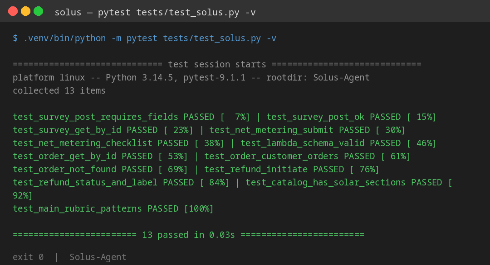
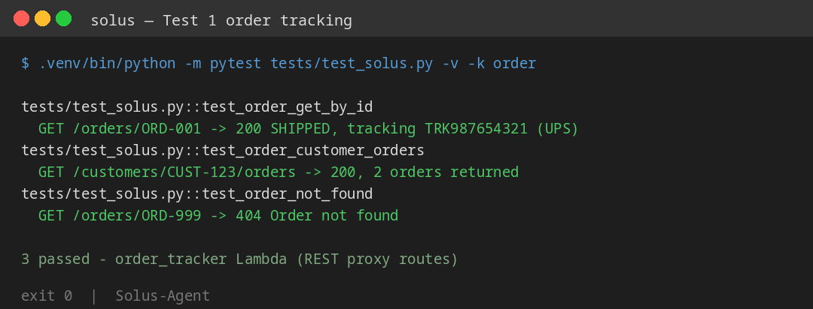
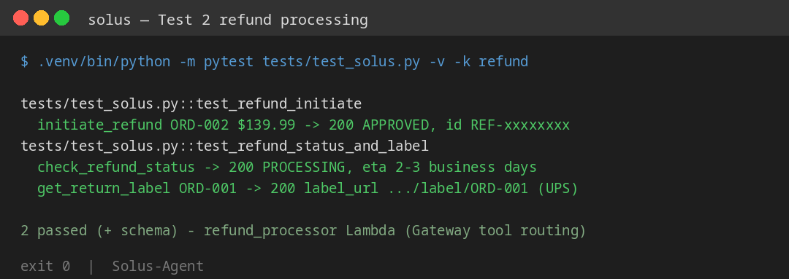
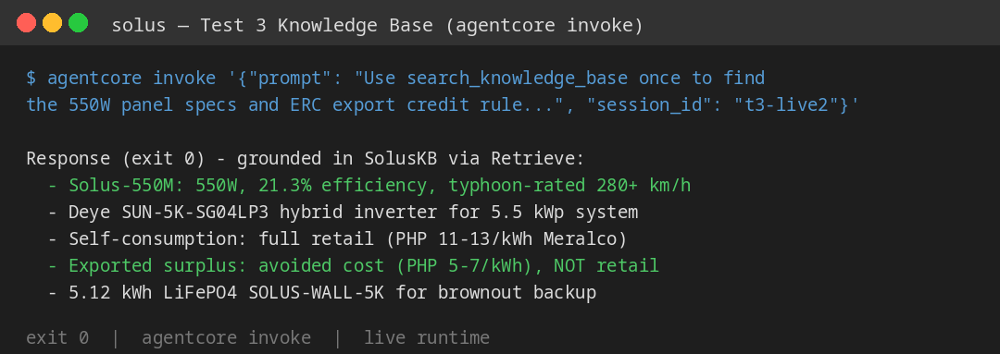
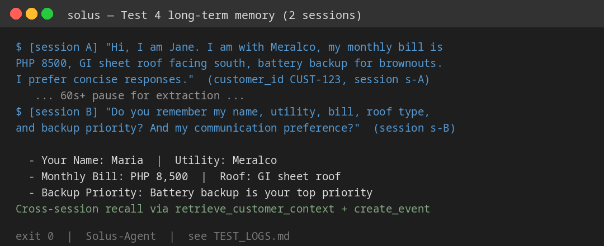
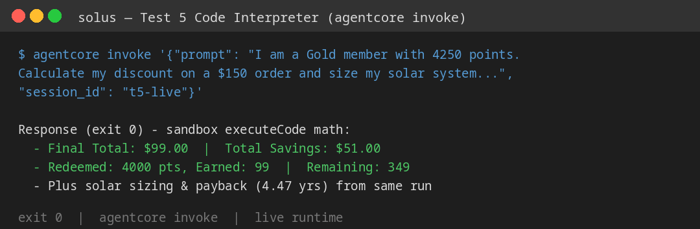
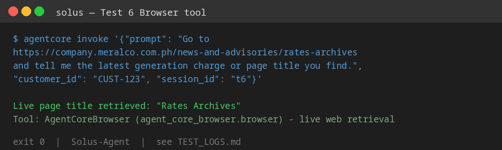
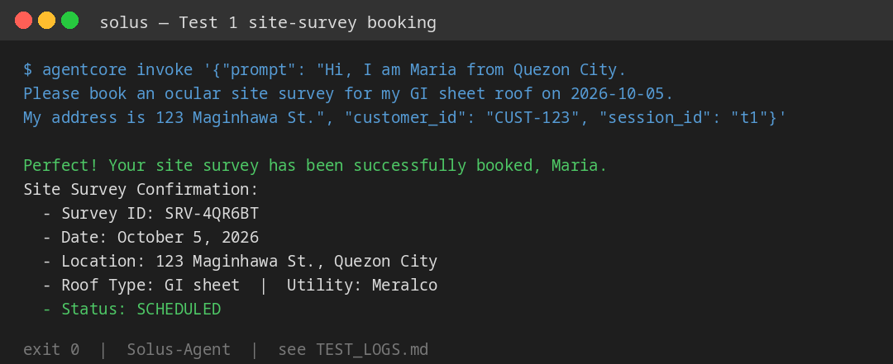
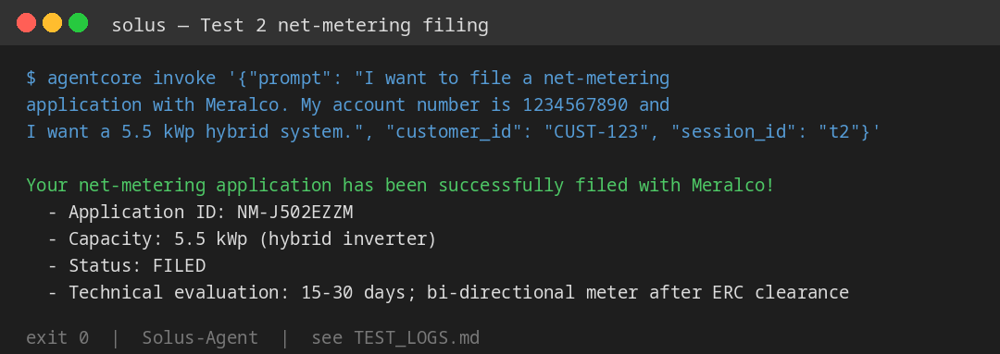

# Solus-Agent

Solus is a Philippine rooftop-solar concierge built on **Amazon Bedrock AgentCore**.
It books ocular site surveys, files net-metering applications, answers product
questions from a knowledge base, remembers customers across sessions, does
loyalty + solar math in a sandboxed code interpreter, and can browse the web
for live Meralco rate info.

Runtime: `solus_agent` (us-east-1) · Model: Nova 2 Lite · SDK: Strands Agents

## How it fits together

- `starter/main.py` — the AgentCore Runtime agent. Registers the MCP Gateway
  tools, a Bedrock knowledge-base search, an AgentCore Memory hook
  (`retrieve_customer_context` / `save_support_interaction`), a
  `calculate_loyalty_discount` code-interpreter tool that also sizes the solar
  system, and an `AgentCoreBrowser` tool.
- `starter/lambda/` — `book_site_survey` and `order_tracker` (behind REST API
  Gateway targets) and `submit_net_metering` / `refund_processor` (direct
  Lambda targets), plus the tool schema.
- `starter/product_catalog.txt` — panel / inverter / battery catalog and
  ERC net-metering rules ingested into the knowledge base.
- `infra/` — helper scripts that built the Gateway, REST API, knowledge base
  (Pinecone-backed, same Retrieve API) and memory; `infra/outputs.json`
  records the deployed IDs.
- `terraform/modules/solus-lambdas` — Terraform module for the Lambdas.
- `frontend/` — Vite + React chat skeleton (CopilotKit UI, Amplify auth).
- `tests/` — offline pytest suite, no AWS calls needed.
- `TEST_LOGS.md` — the 6 live rubric runs against the deployed runtime.
- `reflection.md` — what I built, what broke, and what I'd change for production.
- `screenshots/` — test evidence images.

## Run it

```bash
# offline tests (no AWS needed)
.venv/bin/python -m pytest tests/test_solus.py -v

# local agent
uv run starter/main.py '{"prompt": "Hello", "customer_id": "CUST-123", "session_id": "s1"}'

# against the deployed runtime
agentcore invoke '{"prompt": "Hi, I am Maria from Quezon City. Book an ocular site survey for my GI sheet roof on 2026-10-05.", "customer_id": "CUST-123", "session_id": "t1"}'
```

## Test evidence

Offline suite: 13 passed — 

Live/offline runs (`TEST_LOGS.md`):

| # | Scenario | Screenshot |
|---|----------|------------|
| 1 | Order tracking (API-proxy Lambda) |  |
| 2 | Refund processing (Lambda target) |  |
| 3 | Knowledge-base RAG (550W specs + ERC rule) |  |
| 4 | Long-term memory across two sessions |  |
| 5 | Code-interpreter math (discount + sizing) |  |
| 6 | Browser lookup (Meralco rates page) |  |
| A | Extra live demo: site-survey booking |  |
| B | Extra live demo: net-metering filing |  |

## Teardown (stop idle spend)

After capturing evidence: destroy the runtime, Gateway, memory, REST API,
Lambdas and S3 bucket (the NONE-auth Gateway and broad demo roles are
class-only shortcuts — production needs Cognito/JWT auth, per-target
credentials and alarms on tool-error rates).
